# Authors
[Jake Chen](https://github.com/jakechen): Lead AI/ML Architect; 
[Ivan Cui](https://github.com/whosivan): AI/ML Architect; 
[Jack Tanny](https://github.com/tannyj17): ML/Data Engineer; 
[Gauhar Bains](https://github.com/gauharbains): ML Engineer; 
[Chen Yang](https://github.com/yangc5): ML Engineer; 
[Andrew Preston](https://github.com/kesar-pista): Lead Data Architect; 
[Isaac Owusu](https://github.com/iowusu): Lead Data Architect; 
[Shrimanth Ajjamane Manohar](https://github.com/ShrimanthAM): Data Engineer; 
[Ananya Koduri](https://github.com/lananya): Data Enginee; 
[Josh Bonello](https://github.com/Josh-Bonello): Lead DevOps Architect; 

# About this respository
This repository provides a sample Amazon Cloud Development Kit (CDK) application that trains and deploys a basic Machine Learning model for industrial assets. The solution is targeted at HVAC (Heating, Ventilation, and Air Conditioning) and manufacturing usecases, where pieces of equipment (assets) can be represented in a graph. Amazon Neptune is the graph database used to store the asset's metadata. AWS IoT SiteWise stores the asset's telemetry data. We will use a simple statistical anomaly detection method to detect analogous temperature values on the provided synthetic data. However, this repository could be repurposed to include your own custom ML model, taking advantage of the graph relationships within Neptune.

# How does it work?
The application is broken up into two parts - a training pipeline and an inference pipeline. The training pipeline collects data from Amazon Neptune and AWS IoT SiteWise, starts an AWS Batch job to train the model, and deploys the model as an AWS Lambda function. The inference pipeline collects inference data from Amazon Neptune and AWS IoT SiteWise and invokes the inference AWS Lambda function. 

Below, you can see the architecture diagram of the solution. 
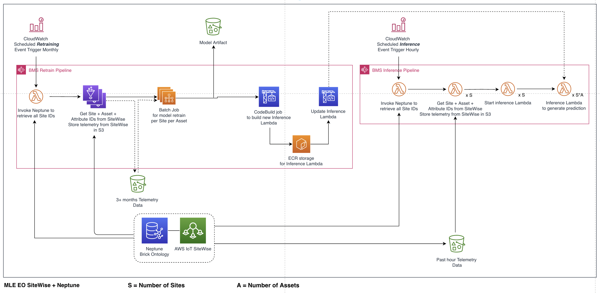

# How to use it?

Follow the below steps to setup and test the application in your own AWS account. To do so, you'll need AWS Console and AWS CLI access to your AWS account with the necessary permissions. It is also recommended to have a basic understanding of AWS IoT SiteWise, Amazon Neptune, and AWS Step Functions. 

### Initial Setup

Clone this repository:

```
$ git clone <repository-url>
```

Setup the AWS CLI:
```
$ aws configure
```

Setup a python virtualenv within the dependencies required to deploy the applications.
```
$ python3 -m venv .venv
$ source .venv/bin/activate
$ pip install -r requirements.txt
```

### Amazon CDK Application Deployment

This application is comprised of two stacks, one for the Amazon Neptune Graph Database, and another for the Machine Learning application. You'll want to deploy both CDK applications to your AWS account. Follow the below steps to do so.

To manually create a virtualenv on MacOS and Linux:

```
$ python3 -m venv .venv
```

After the init process completes and the virtualenv is created, you can use the following
step to activate your virtualenv.

```
$ source .venv/bin/activate
```

If you are a Windows platform, you would activate the virtualenv like this:

```
% .venv\Scripts\activate.bat
```

Once the virtualenv is activated, you can install the required dependencies.

```
$ pip install -r requirements.txt
```

At this point you can now synthesize the CloudFormation template for this code.

```
$ cdk synth
```

Once the stack has synthesized, you can deploy. 

```
$ cdk deploy --all
```

### AWS IoT SiteWise Setup

To construct the AWS IoT SiteWise environment, follow the below steps in the AWS IoT SiteWise console. You may find the [following documentation](https://docs.aws.amazon.com/iot-sitewise/latest/userguide/industrial-asset-models.html) useful if you are new to AWS IoT SiteWise.

1. In the AWS IoT SiteWise console, create an IoT SiteWise Model for a Roof Top Unit (RTU). In our example, the RTU is the piece of industrial equipment that we will monitor. The RTU has two Attributes, an Asset name and a Site ID. It has four Measurements, brick:Outside_Air_Humidity_Sensor, brick:Outside_Air_Temperature_Sensor, brick:Zone_Air_Humidity_Sensor, and brick:Zone_Air_Temperature_Sensor. Leave the Transforms, Metrics, and Hierarchy definitions blank. 

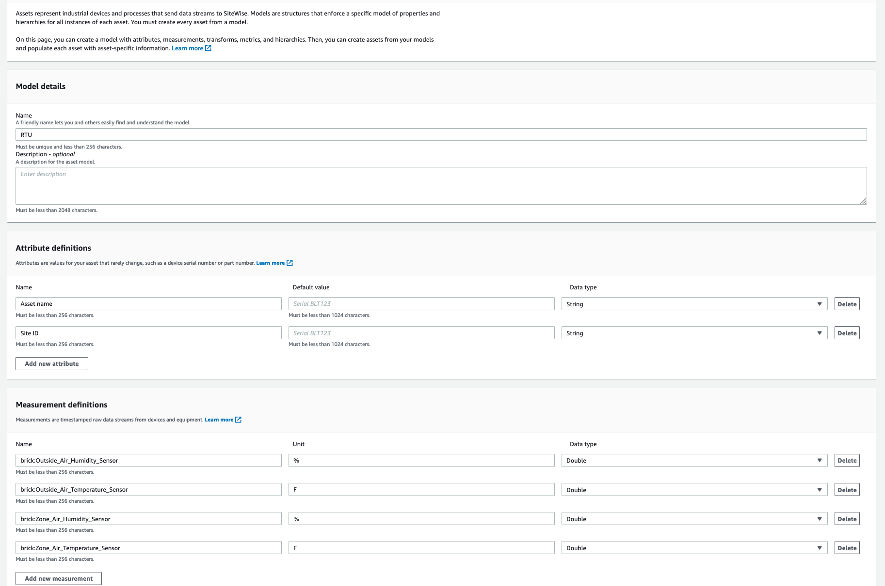

2. Create an IoT SiteWise Model for a Site. A Site in this example is the physical building that houses RTUs. A Site only has one attribute, Site ID. It does have a Hierarchy, which represents that RTUs are within a Site. Add the Hierarchy as shown below. 

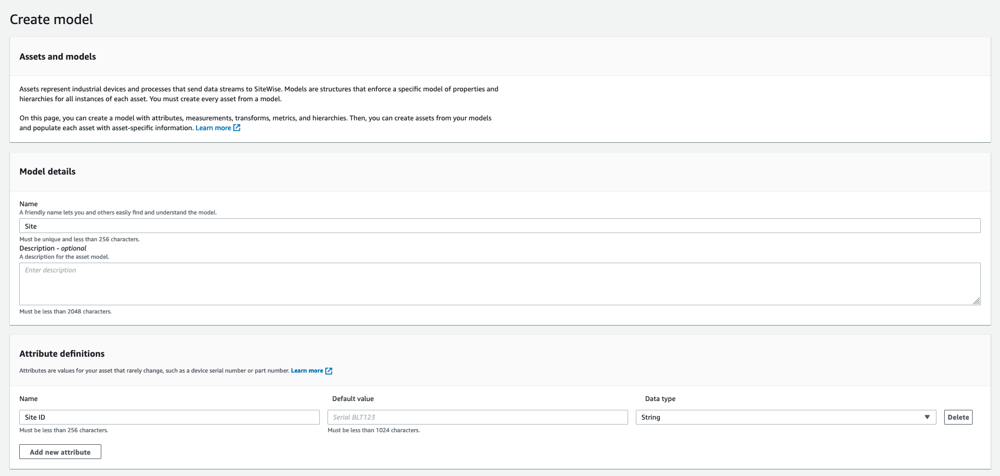
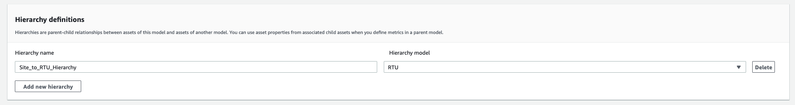

3. Create AWS IoT SiteWise Assets. Create a SITE_01 Asset, of the Site model. Also create 3 RTUs, named RTU_001, RTU_002, and RTU_003: 

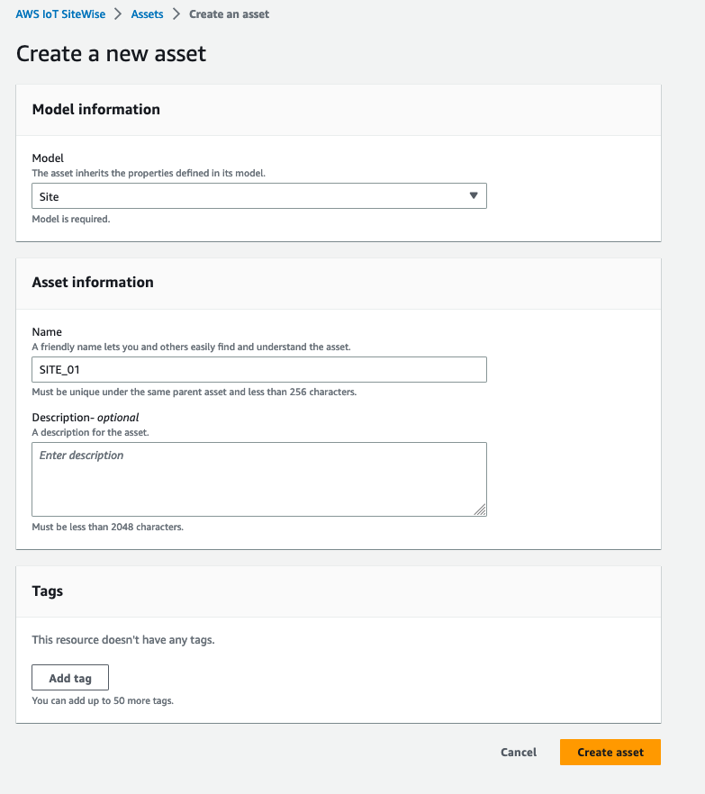
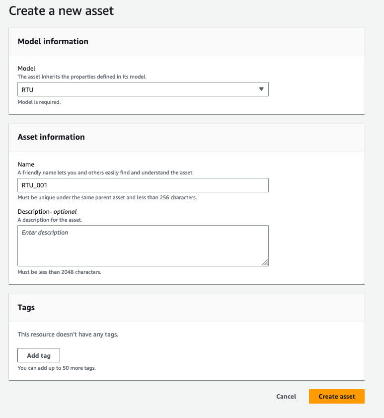

4. Associate RTUs with the Site. 'Edit' the SITE_01 asset to associate the RTUs with the SITE_01. 

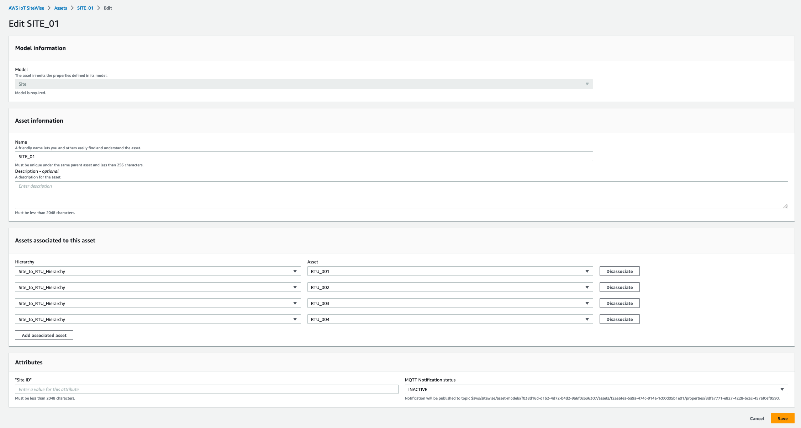

5. Setup AWS IoT SiteWise Cold tier storage. Cold tier storage allows for SiteWise to write data to S3 to reduce the cost of storing the data in the Hot tier. 

Set the S3 bucket location to the model-data bucket.

```
s3://model-data-bucket-<account-id>/
```

Create a retention period of 30 days.

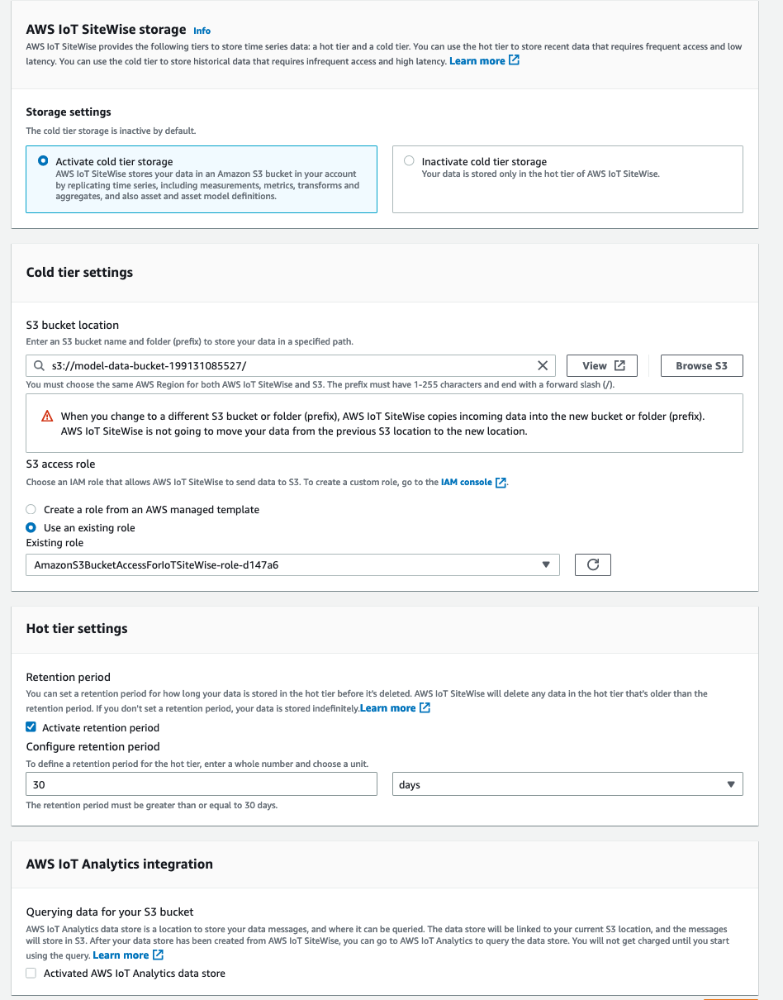

6. Load the RTU data into SiteWise. Now that we have modeled the Sites and Assets in SiteWise, we need to load the telemetry data that the ML models will be trained on. When the CDK stack was deployed, sample data was uploaded to the model-data S3 bucket. We will now use the AWS CLI to upload the data from S3 to AWS IoT SiteWise.

**First, replace the four 12-digit AWS account IDs in bulk-import-job-config.json file with *your* account ID.**

Next, run the following AWS CLI command. 
```
$ aws iotsitewise create-bulk-import-job --cli-input-json file://bulk-import-job-config.json
```

You can run the following AWS CLI command to check on the status of the bulk import job:
```
$ aws iotsitewise list-bulk-import-jobs
```

7. Lastly, you'll need to create an [Amazon VPC Interface Endpoint](https://docs.aws.amazon.com/iot-sitewise/latest/userguide/vpc-interface-endpoints.html) for AWS IoT SiteWise. 

On the VPC console, navigate to Endpoints, and select Create Endpoint.

For service name, select com.amazonaws.us-east-1.iotsitewise.api
For VPC, select the NeptuneNotebookStack VPC.
Select all available subnets.
For Security Groups, select the RetrainStack-LambdaToNeptuneSg. 
Leave the rest of the options as defaulted. 

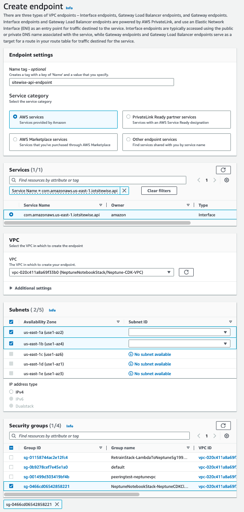

Create a second VPC Endpoint, but this time select com.amazonaws.us-east-1.iotsitewise.data as the service name. Use the same parameters from the previously created endpoint.

You should see both endpoints once completed:

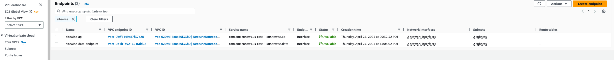

**Don't proceed with the next step until the bulk import job succeeds.**

7. Associate the newly created Data streams with the RTU Assets. Select a Data stream, Select Manage data streams, and choose the Measurement corresponding to the Site, RTU, and brick sensor name. Do so for all 12 Data streams. 

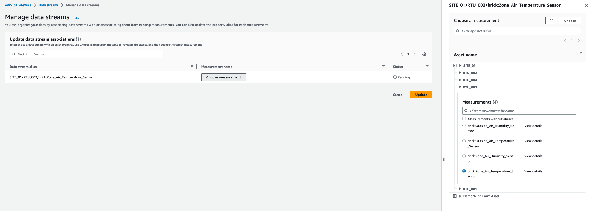

Once complete, your Data streams should look like this: 

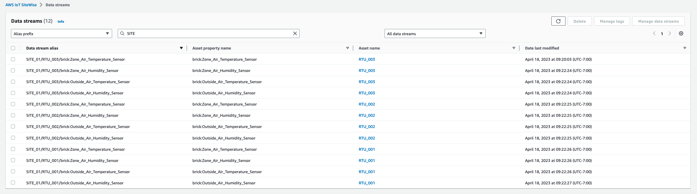

### Amazon Neptune Setup

Amazon Neptune offers Jupyter Notebooks - a fully managed interactive development environment for Neptune. We will use a Neptune Notebook to load Neptune with the Asset information from Sitewise. If you are new to Neptune notebooks, I'd suggest taking a look at the documentation [here](https://docs.aws.amazon.com/neptune/latest/userguide/graph-notebooks.html). 

1. Create an Amazon Neptune Notebook. Give it a name, and select 'Create new IAM role'.

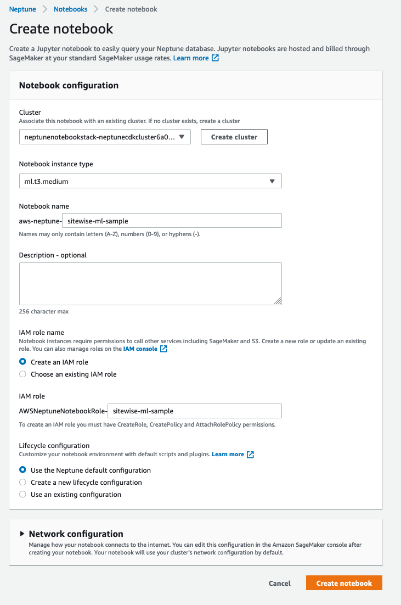

2. Attach the following policy to the IAM role created when the Neptune Notebook was developed.

```
{
    "Version": "2012-10-17",
    "Statement": [
        {
            "Action": [
                "s3:GetObject",
                "s3:GetBucketLocation",
                "s3:PutObject",
                "s3:ListBucket"
            ],
            "Resource": [
                "arn:aws:s3:::model-data-bucket-199131085527",
                "arn:aws:s3:::model-data-bucket-199131085527/*"
            ],
            "Effect": "Allow"
        }
    ]
}
```

3. Add the *neptune-load-from-s3-<accountid>* IAM Role to the Neptune cluster.

In the Neptune console, select the Neptune cluster, and select 'Manage IAM roles'.
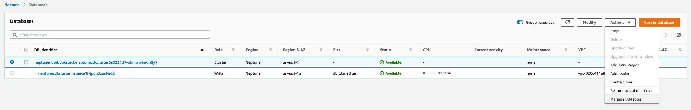

Add the role to the cluster, and wait until it is finished. 
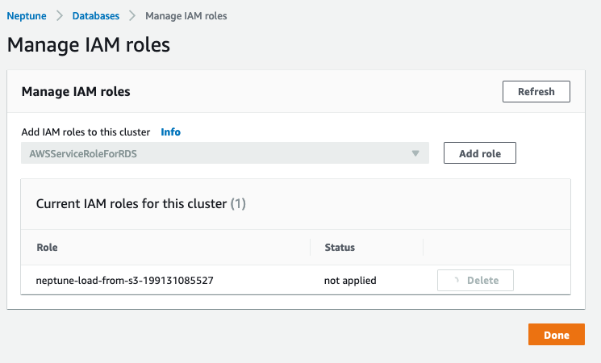

4. Create an S3 Endpoint:

Follow the instructions for Creating the [Amazon S3 VPC Endpoint](https://docs.aws.amazon.com/neptune/latest/userguide/bulk-load-tutorial-IAM.html) in the Neptune documentation. 

5. Edit the site_data.csv file included in this repo. You'll need to add the SiteWise Asset IDs and SiteWise Point Property IDs for each RTU. 

Asset ID:
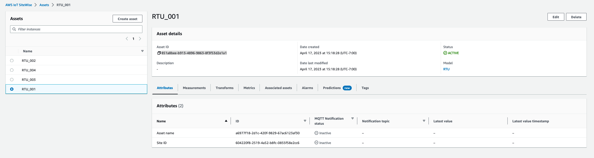

Point Property ID:
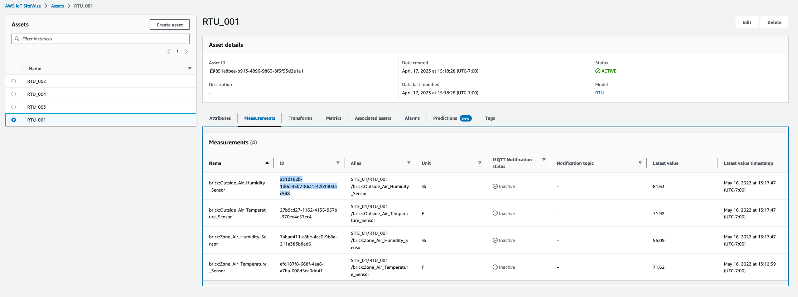

Once completed, the csv should look like this:
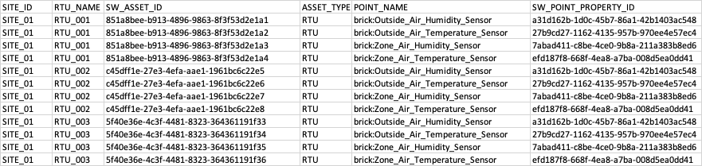

Upload the site_data.csv to the model-data-bucket-<accountid> S3 bucket. 

5. Upload the LoadData.ipynb file from this repo to the Neptune Notebook. Edit the three variables defined in the first cell. 

The first is the account ID. 

The second is the neptune cluster writer node URL. This can be found on the neptune console here:
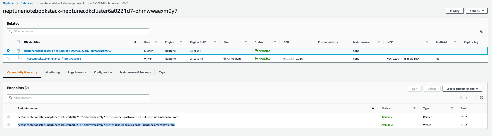

The third is the region this application is deployed in. 

6. Run all cells in the Jupyter Notebook. You may need to create a VPC endpoint. If so, follow [these steps](https://docs.aws.amazon.com/neptune/latest/userguide/bulk-load-data.html#bulk-load-prereqs-s3). 

You should end up with a response similar to the following:
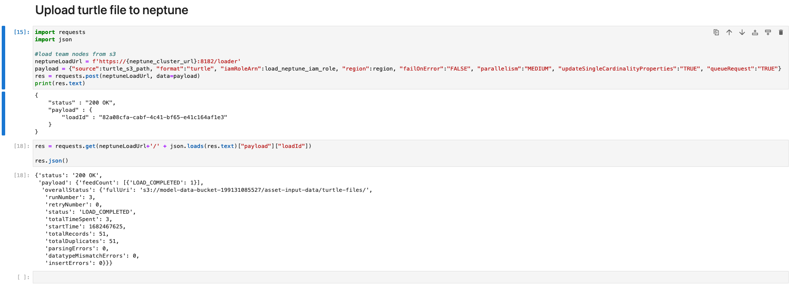

Once all cells are run in the Notebook, you are ready to test the application!

### Train the Model

To train the model, you'll want to trigger the AWS Step Functions retrain-pipeline. 

1. In the AWS Management Console, find the retrain-pipeline State machine.
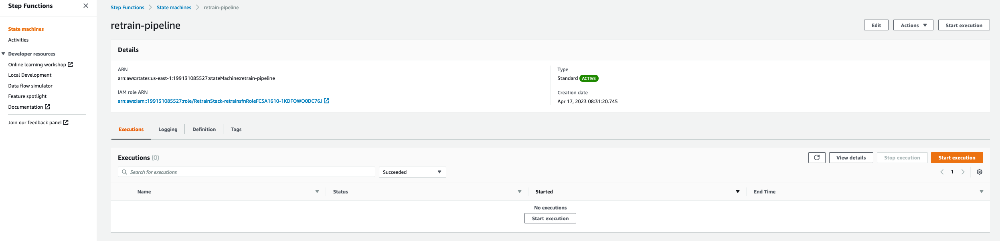

2. Click 'Start Execution' to manually trigger the state machine. Replace the input with the following JSON data.
```
{
  "id": "3f3b617e-ec79-4794-b821-d37394b7fa72",
  "resources": [
    "retrainrule"
  ]
}
```

 The Name of the execution and "id" should be the same. We recommend using the auto-generated Name as the "id". See below:
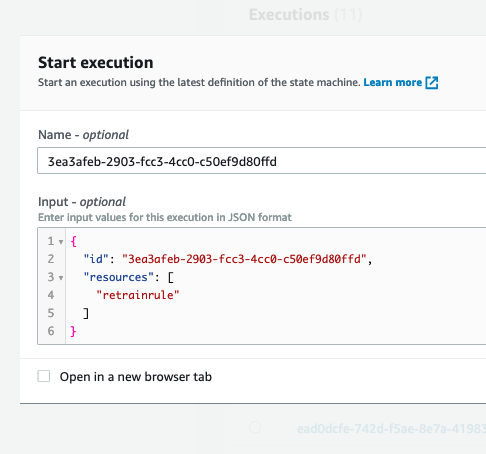

The retrain-pipeline has completed successfully when all steps of the pipeline succeeded and are marked as green.
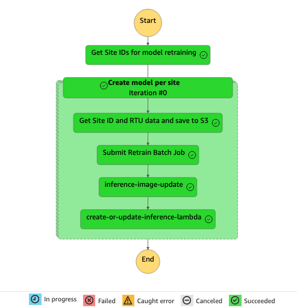


### Run inference on the Model

Once the model is trained, we can begin using it to perform inference. 

1. In the AWS Management Console, find the inference-pipeline State machine.

2. Click 'Start Execution' to manually trigger the state machine. Replace the input with the following JSON data. 
```
{
  "id": "3f3b617e-ec79-4794-b821-d37394b7fa72",
  "resources": [
    "inferrule"
  ]
}
```

The Name of the execution and "id" should be the same. We recommend using the auto-generated Name as the "id". See below:
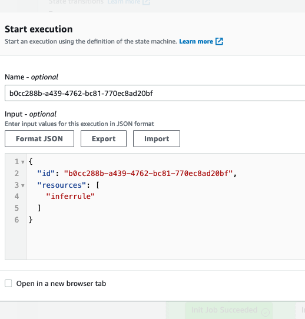


Once completed successfully, you can view the outputs of the model at the following S3 location:
model-data-bucket-<accountid>/inference/<inference-pipeline-event-id>/site_01.csv


