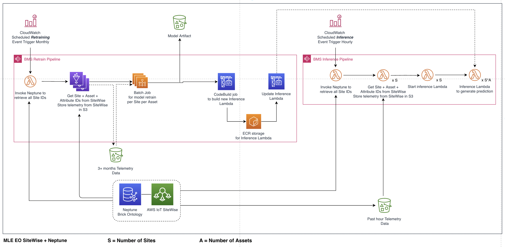

# About this respository
This repository provides a sample Amazon Cloud Development Kit (CDK) application that trains and deploys a basic Machine Learning model for industrial assets. The solution is targeted at HVAC and manufacturing usecases, where pieces of equipment (assets) can be represented in a graph. Amazon Neptune is the graph database used to store the asset's metadata. AWS IoT SiteWise stores the asset's telemetry data. We will use a simple statistical anomaly detection method to detect analogous temperature values on the provided synthetic data. However, this repository could be repurposed to include your own custom ML model, taking advantage of the graph relationships within Neptune.

# How does it work?
The application is broken up into two parts - a training pipeline and an inference pipeline. The training pipeline collects data from Amazon Neptune and AWS IoT SiteWise, starts an AWS Batch job to train the model, and deploys the model as an AWS Lambda function. The inference pipeline collects inference data from Amazon Neptune and AWS IoT SiteWise and invokes the inference AWS Lambda function. 

Below, you can see the architecture diagram of the solution. 


# How to use it?

Follow the below steps to setup and test the application in your own AWS account. To do so, you'll need AWS Console and AWS CLI access to your AWS account with the necessary permissions. 

### Initial Setup

Setup the AWS CLI:
```
$ aws configure
```

Setup a python virtualenv within the dependencies required to deploy the applications.
```
$ python3 -m venv .venv
$ source .venv/bin/activate
$ pip install -r requirements.txt
```

### Amazon CDK Application Deployment

Deploy both CDK applications to your AWS account. You 

# Deployment Steps

This repository is dependent on a Neptune repository. The Neptune respository must be deployed first. 

The `cdk.json` file tells the CDK Toolkit how to execute your app.

This project is set up like a standard Python project.  The initialization
process also creates a virtualenv within this project, stored under the `.venv`
directory.  To create the virtualenv it assumes that there is a `python3`
(or `python` for Windows) executable in your path with access to the `venv`
package. If for any reason the automatic creation of the virtualenv fails,
you can create the virtualenv manually.

To manually create a virtualenv on MacOS and Linux:

```
$ python3 -m venv .venv
```

After the init process completes and the virtualenv is created, you can use the following
step to activate your virtualenv.

```
$ source .venv/bin/activate
```

If you are a Windows platform, you would activate the virtualenv like this:

```
% .venv\Scripts\activate.bat
```

Once the virtualenv is activated, you can install the required dependencies.

```
$ pip install -r requirements.txt
```

At this point you can now synthesize the CloudFormation template for this code.

```
$ cdk synth
```

Once the stack has synthesized, you can deploy. 

```
$ cdk deploy --all
```
