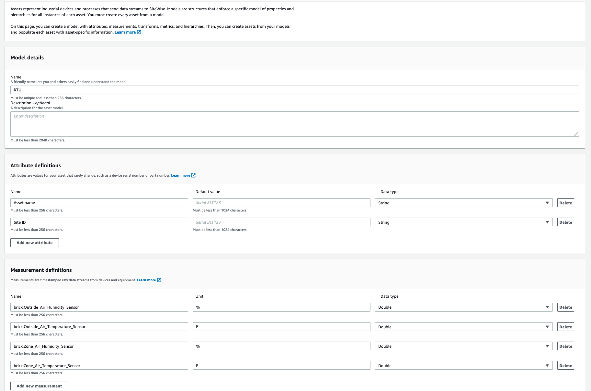
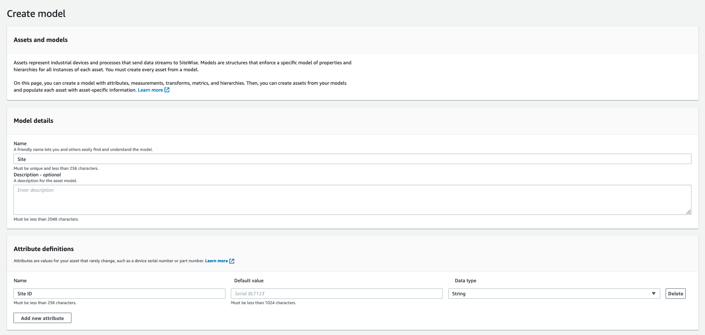
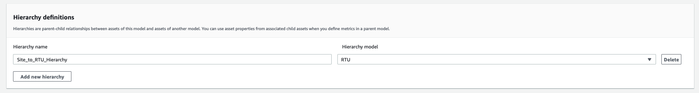
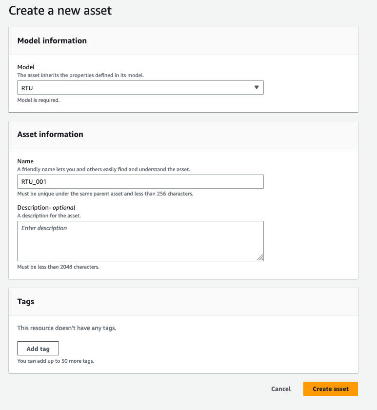
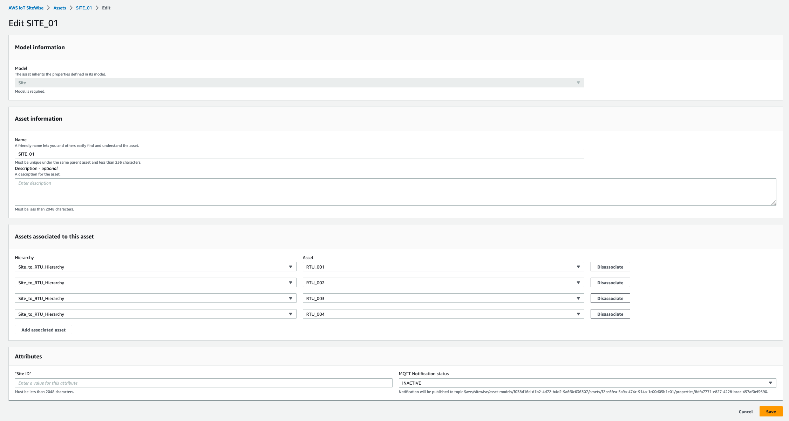
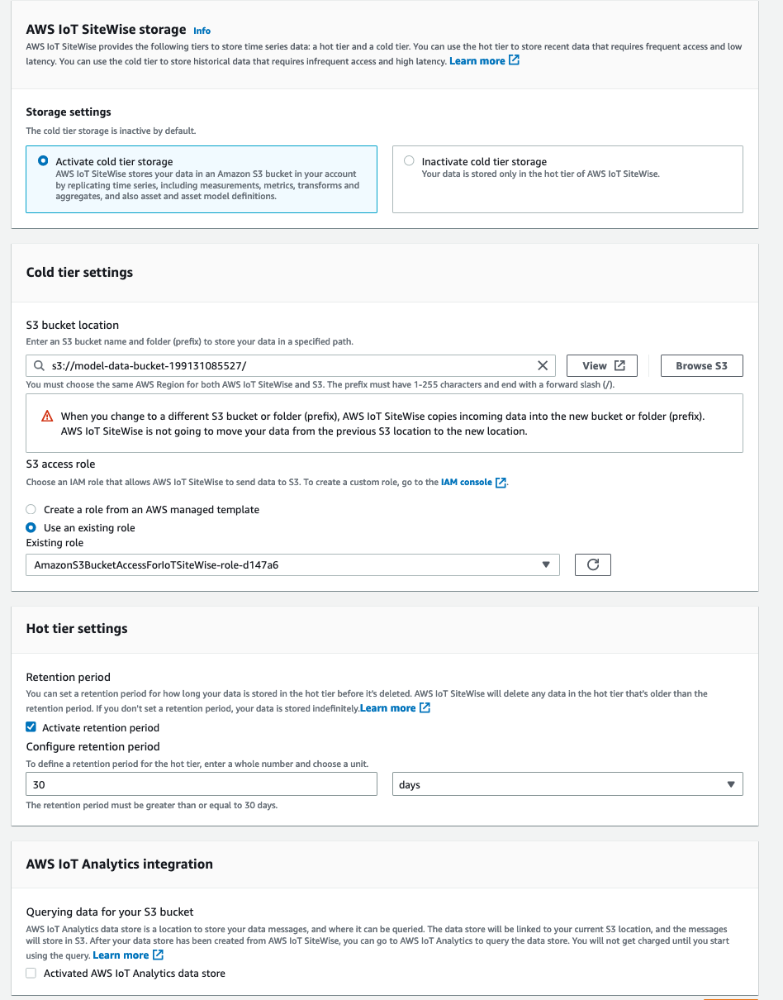

# About this respository
This repository provides a sample Amazon Cloud Development Kit (CDK) application that trains and deploys a basic Machine Learning model for industrial assets. The solution is targeted at HVAC and manufacturing usecases, where pieces of equipment (assets) can be represented in a graph. Amazon Neptune is the graph database used to store the asset's metadata. AWS IoT SiteWise stores the asset's telemetry data. We will use a simple statistical anomaly detection method to detect analogous temperature values on the provided synthetic data. However, this repository could be repurposed to include your own custom ML model, taking advantage of the graph relationships within Neptune.

# How does it work?
The application is broken up into two parts - a training pipeline and an inference pipeline. The training pipeline collects data from Amazon Neptune and AWS IoT SiteWise, starts an AWS Batch job to train the model, and deploys the model as an AWS Lambda function. The inference pipeline collects inference data from Amazon Neptune and AWS IoT SiteWise and invokes the inference AWS Lambda function. 

Below, you can see the architecture diagram of the solution. 


# How to use it?

Follow the below steps to setup and test the application in your own AWS account. To do so, you'll need AWS Console and AWS CLI access to your AWS account with the necessary permissions. It is also recommended to have a basic understanding of AWS IoT SiteWise, Amazon Neptune, and AWS Step Functions. 

### Initial Setup

Setup the AWS CLI:
```
$ aws configure
```

Setup a python virtualenv within the dependencies required to deploy the applications.
```
$ python3 -m venv .venv
$ source .venv/bin/activate
$ pip install -r requirements.txt
```

### Amazon CDK Application Deployment

This application is comprised of two stacks, one for the Amazon Neptune Graph Database, and another for the Machine Learning application. You'll want to deploy both CDK applications to your AWS account. Follow the below steps to do so.

To manually create a virtualenv on MacOS and Linux:

```
$ python3 -m venv .venv
```

After the init process completes and the virtualenv is created, you can use the following
step to activate your virtualenv.

```
$ source .venv/bin/activate
```

If you are a Windows platform, you would activate the virtualenv like this:

```
% .venv\Scripts\activate.bat
```

Once the virtualenv is activated, you can install the required dependencies.

```
$ pip install -r requirements.txt
```

At this point you can now synthesize the CloudFormation template for this code.

```
$ cdk synth
```

Once the stack has synthesized, you can deploy. 

```
$ cdk deploy --all
```

### AWS IoT SiteWise Setup

To construct the AWS IoT SiteWise environment, follow the below steps in the AWS IoT SiteWise console. You may find the [following documentation](https://docs.aws.amazon.com/iot-sitewise/latest/userguide/industrial-asset-models.html) useful if you are new to AWS IoT SiteWise.

1. In the AWS IoT SiteWise console, create an IoT SiteWise Model for a Roof Top Unit (RTU). In our example, the RTU is the piece of industrial equipment that we will monitor. The RTU has two Attributes, an Asset name and a Site ID. It has four Measurements, brick:Outside_Air_Humidity_Sensor, brick:Outside_Air_Temperature_Sensor, brick:Zone_Air_Humidity_Sensor, and brick:Zone_Air_Temperature_Sensor. Leave the Transforms, Metrics, and Hierarchy definitions blank. 



2. Create an IoT SiteWise Model for a Site. A Site in this example is the physical building that houses RTUs. A Site only has one attribute, Site ID. It does have a Hierarchy, which represents that RTUs are within a Site. Add the Hierarchy as shown below. 




3. Create AWS IoT SiteWise Assets. Create a SITE_01 Asset, of the Site model. Also create 4 RTUs, named RTU_001, RTU_002, RTU_003, and RTU_004. 




4. Associate RTUs with the Site. 'Edit' the SITE_01 asset to associate the RTUs with the SITE_01. 



5. Setup AWS IoT SiteWise Cold tier storage. Cold tier storage allows for SiteWise to write data to S3 to reduce the cost of storing the data in the Hot tier. 

Set the S3 bucket location to the model-data bucket.

```
s3://model-data-bucket-<account-id>/
```

Create a retention period of 30 days.



6. Load the RTU data into SiteWise. Now that we have modeled the Sites and Assets in SiteWise, we need to load the telemetry data that the ML models will be trained on. When the CDK stack was deployed, sample data was uploaded to the model-data S3 bucket. We will now use the AWS CLI to upload the data from S3 to AWS IoT SiteWise.

First, replace the four 12-digit AWS account IDs in bulk-import-job-config.json file with your account ID. 

Next, run the following AWS CLI command. 
```
aws iotsitewise create-bulk-import-job --cli-input-json file://bulk-import-job-config.json
```

You can run the following AWS CLI command to check on the status of the bulk import job:
```
aws iotsitewise create-bulk-import-job
```
Don't proceed with the next step until the bulk import job succeeds.

7. Associate the 


